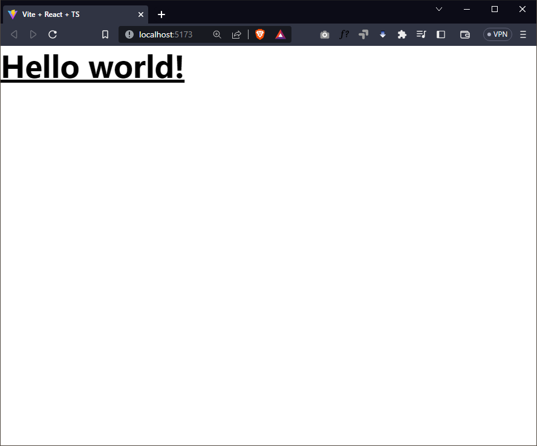
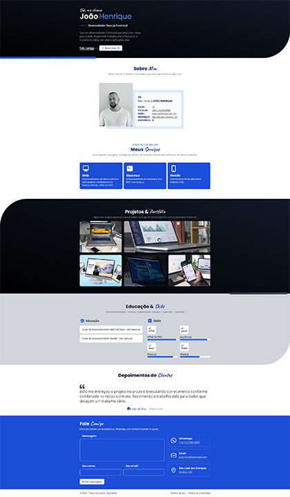

# React Portfolio

Este é o um portfólio feito com React. Ele foi desenvolvido para o conteúdo da [Master Class #012](https://www.youtube.com/watch?v=_AcdTQM5xJM) da [Dev Samurai](https://devsamurai.com.br/).

[](https://www.youtube.com/watch?v=_AcdTQM5xJM)

🚨 **AVISO IMPORTANTE** 🚨

Caso o vídeo esteja como PRIVADO, isso significa que essa Master Class já saiu do ar e está disponível apenas na nossa [comunidade](https://lp.devsamurai.com.br/wue3c2p5/?xpromo=yt-_AcdTQM5xJM).

## Como funciona

Esta é uma aplicação React que utiliza o Vite como bundler e o TailwindCSS como framework CSS.

## Como executar

Acesse o diretório do projeto e execute o comando:

```bash
npm install
npm preview
```

## Passo a passo

1. [x] Criar o projeto com o Vite
2. [x] Instalar e configurar o TailwindCSS
3. [x] Criar as sessões da página Home
4. [x] Criando cada sessão/componente
5. [x] Adicionando o serviço de envio de mensagens
6. [x] Deploy da aplicação

### Passo 1: Criar o projeto com o Vite

Para criar o projeto, vamos utilizar o [Vite](https://vitejs.dev/), um bundler extremamente rápido e simples de configurar.

```bash
npm create vite@latest
```

E depois escolher as seguintes opções:

- `? Project name: › react-3d-portfolio`
- `? Select a framework: › React`
- `? Select a variant: › TypeScript`

Referências:

- <https://vitejs.dev/guide/>

### Passo 2: Instalar e configurar o TailwindCSS

Para instalar o TailwindCSS, vamos utilizar o [PostCSS](https://postcss.org/), um processador de CSS que nos permite utilizar plugins para transformar nosso CSS.

```bash
npm install -D tailwindcss postcss autoprefixer tailwind-styled-components
npx tailwindcss init -p
```

Na sequência, vamos ajustar o arquivo `tailwind.config.js` com o seguinte conteúdo:

```js
/** @type {import('tailwindcss').Config} */
export default {
  content: ["./index.html", "./src/**/*.{js,ts,jsx,tsx}"], // adicionar isso...
  theme: {
    extend: {},
  },
  plugins: [],
}
```

E adicionar os plugins Prettier para o TailwindCSS:

```bash
npm install -D prettier prettier-plugin-tailwindcss eslint-plugin-prettier
```

E ajustar o arquivo `.eslintrc.cjs` com o seguinte conteúdo:

```js
module.exports = {
  env: { browser: true, es2020: true },
  extends: [
    "eslint:recommended",
    "plugin:@typescript-eslint/recommended",
    "plugin:react-hooks/recommended",
    // adicionando o prettier...
    "prettier-plugin-tailwindcss",
    "plugin:prettier/recommended",
    "prettier",
  ],
  parser: "@typescript-eslint/parser",
  parserOptions: { ecmaVersion: "latest", sourceType: "module" },
  plugins: ["react-refresh"],
  rules: {
    "react-refresh/only-export-components": "warn",
  },
}
```

E também, vamos abrir o arquivo `./src/index.css` e substituir todo o conteúdo por isso:

```css
@tailwind base;
@tailwind components;
@tailwind utilities;
```

Como já temos o TailWindCSS instalado e configurado no nosso projeto. Agora precisamos remover o conteúdo atual da página `./src/App.tsx` e substituir por um teste simples:

```tsx
import tw from "tailwind-styled-components"

const Title = tw.h1`
  text-3xl font-bold underline
`

function App() {
  return <Title>Hello world!</Title>
}

export default App
```

Como não precisaremos mais do arquivo `./src/App.css`, podemos removê-lo.

E finalmente vamos executar o projeto com o comando:

```bash
npm run dev
```

E abrir o endereço [http://localhost:5173/](http://localhost:5173/) no navegador:



Referências:

- <https://tailwindcss.com/docs/guides/vite>

## Passo 3: Criar as sessões da página Home

Nesta etapa iremos criar todas as sessões/componentes da página Home em seu estado inicial.

- About: `./components/About.tsx`
- Contact: `./components/Contact.tsx`
- Footer: `./components/Footer.tsx`
- Hero: `./components/Hero.tsx`
- Projects: `./components/Projects.tsx`
- Services: `./components/Services.tsx`
- Skills: `./components/Skills.tsx`
- Testimonials: `./components/Testimonials.tsx`

Inicialmente cada sessão conterá apenas um título, por exemplo:

```tsx
export default function Hero() {
  return (<h1>Hero</h1>)
}
```

E com isso adicionamos todas as sessões na página Home:

```tsx
import About from "./components/About"
import Contact from "./components/Contact"
import Footer from "./components/Footer"
import Hero from "./components/Hero"
import Projects from "./components/Projects"
import Services from "./components/Services"
import Skills from "./components/Skills"
import Testimonials from "./components/Testimonials"

function App() {
  return (
    <>
      <main>
        <Hero />
        <About />
        <Services />
        <Projects />
        <Skills />
        <Testimonials />
        <Contact />
      </main>
      <footer>
        <Footer />
      </footer>
    </>
  )
}

export default App
```

Dessa forma já temos todas as sessões/componentes da página Home criadas e estamos prontos para iniciar a criação de cada uma.

## Passo 4: Criando cada sessão/componente

Chegou o momento de criamos cada sessão do nosso site, para isso vamos utilizar o TailwindCSS para nos ajudar com os estilos e estilizar cada uma para que possamos ter a seguinte aparência final.

Você pode consultar cada componente para que entenda como foi feito, mas não se preocupe, pois explicamos cada detalhe no vídeo.



## Passo 5: Criando a página de detalhes do projeto

Para o envio de mensagens vamos utilizar o [EmailJS](https://www.emailjs.com/), que é um serviço gratuito de envio de formulários.

Para isso, vamos instalar o pacote `@emailjs/browser`:

```bash
npm install @emailjs/browser
```

E depois ajustar o nosso componente `Contact` com o seguinte conteúdo:

```tsx
const sendEmail = (event: FormEvent<HTMLFormElement>) => {
  event.preventDefault()

  if (!form.current) return

  setLoading(true)

  emailjs
    .sendForm(
      "<service id>",
      "<template id>",
      form.current,
      "<public key>"
    )
    .then(
      () => {
        setSuccess(true)
        setLoading(false)
      },
      (error) => {
        setError(true)
        setLoading(false)
        console.error(error)
      }
    )
}
```

## Passo 6: Deploy da aplicação

Para realizar o deploy da aplicação, vamos utilizar o [GitHub Pages](https://pages.github.com/), que é um serviço gratuito de hospedagem de sites estáticos.

Para isso, vamos instalar o pacote `gh-pages`:

```bash
npm install -D gh-pages
```

E adicionar os seguintes scripts no arquivo `package.json`:

```json
{
  "scripts": {
    "predeploy": "npm run build",
    "deploy": "gh-pages -d dist",
  }
}
```

Em seguida vamos configurar o arquivo `vite.config.ts` com o seguinte conteúdo:

```ts
import react from "@vitejs/plugin-react"
import { defineConfig } from "vite"

// https://vitejs.dev/config/
export default defineConfig({
  plugins: [react()],
  base: "/<nome do seu repo>/", // <-- adicionar isso
})
```

Para que possamos habilitar o deploy da aplicação, precisamos criar um repositório **público** no GitHub com um nome sugestivo: `portfolio`.

E então, vamos adicionar o repositório remoto:

```bash
git remote add origin https://github.com/<nome do seu usuario>/<nome do seu repo>.git
git commit -m "Initial commit"
git push -u origin main
```

Por fim, executar o comando de build e deploy:

```bash
npm run deploy
```

E finalmente acessar o endereço `https://<nome do seu usuário>.github.io/<nome do seu repo>`.

No meu caso: <https://felipefontoura.github.io/react-portfolio/>

Referências:

- <https://pages.github.com/>
- <https://vitejs.dev/guide/static-deploy.html#github-pages>
