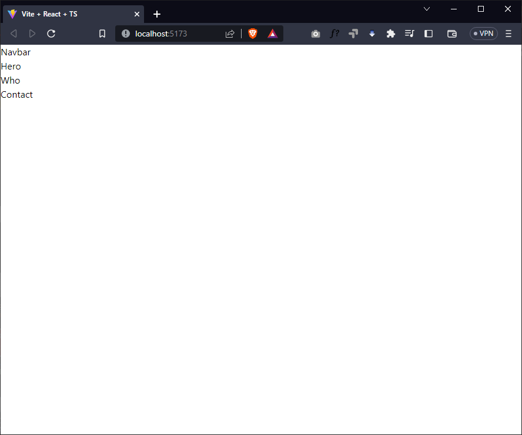
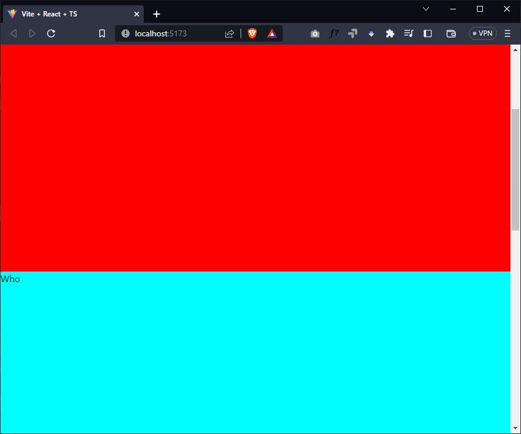

# React 3D Portfolio

Este é o um portfólio 3D, feito com React e Three.js. Ele foi desenvolvido para o conteúdo da [Master Class #012](https://www.youtube.com/watch?v=_AcdTQM5xJM) da [Dev Samurai](https://devsamurai.com.br/).

[](https://www.youtube.com/watch?v=_AcdTQM5xJM)

🚨 **AVISO IMPORTANTE** 🚨

Caso o vídeo esteja como PRIVADO, isso significa que essa Master Class já saiu do ar e está disponível apenas na nossa [comunidade](https://lp.devsamurai.com.br/wue3c2p5/?xpromo=yt-_AcdTQM5xJM).

## Como funciona

## Como executar

## Passo a passo

1. [x] Criar o projeto com o Vite
2. [x] Instalar e configurar o TailwindCSS
3. [x] Criar as primeiras sessões da página Home
4. [x] Criar a base de estilo das sessões
5. [x] Ajustar o efeito de rolagem das sessões
6. [x] Ajustar o fundo das sessões

### Passo 1: Criar o projeto com o Vite

Para criar o projeto, vamos utilizar o [Vite](https://vitejs.dev/), um bundler extremamente rápido e simples de configurar.

```bash
npm create vite@latest
```

E depois escolher as seguintes opções:

- `? Project name: › react-3d-portfolio`
- `? Select a framework: › React`
- `? Select a variant: › TypeScript`

Referências:

- <https://vitejs.dev/guide/>

### Passo 2: Instalar e configurar o TailwindCSS

Para instalar o TailwindCSS, vamos utilizar o [PostCSS](https://postcss.org/), um processador de CSS que nos permite utilizar plugins para transformar nosso CSS.

```bash
npm install -D tailwindcss postcss autoprefixer tailwind-styled-components
npx tailwindcss init -p
```

Na sequência, vamos ajustar o arquivo `tailwind.config.js` com o seguinte conteúdo:

```js
/** @type {import('tailwindcss').Config} */
export default {
  content: ["./index.html", "./src/**/*.{js,ts,jsx,tsx}"], // adicionar isso...
  theme: {
    extend: {},
  },
  plugins: [],
}
```

E adicionar os plugins Prettier para o TailwindCSS:

```bash
npm install -D prettier prettier-plugin-tailwindcss eslint-plugin-prettier
```

E ajustar o arquivo `.eslintrc.cjs` com o seguinte conteúdo:

```js
module.exports = {
  env: { browser: true, es2020: true },
  extends: [
    "eslint:recommended",
    "plugin:@typescript-eslint/recommended",
    "plugin:react-hooks/recommended",
    // adicionando o prettier...
    "prettier-plugin-tailwindcss",
    "plugin:prettier/recommended",
    "prettier",
  ],
  parser: "@typescript-eslint/parser",
  parserOptions: { ecmaVersion: "latest", sourceType: "module" },
  plugins: ["react-refresh"],
  rules: {
    "react-refresh/only-export-components": "warn",
  },
}
```

E também, vamos abrir o arquivo `./src/index.css` e substituir todo o conteúdo por isso:

```css
@tailwind base;
@tailwind components;
@tailwind utilities;
```

Como já temos o TailWindCSS instalado e configurado no nosso projeto. Agora precisamos remover o conteúdo atual da página `./src/App.tsx` e substituir por um teste simples:

```tsx
import tw from "tailwind-styled-components"

const Title = tw.h1`
  text-3xl font-bold underline
`

function App() {
  return <Title>Hello world!</Title>
}

export default App
```

Como não precisaremos mais do arquivo `./src/App.css`, podemos removê-lo.

E finalmente vamos executar o projeto com o comando:

```bash
npm run dev
```

E abrir o endereço [http://localhost:5173/](http://localhost:5173/) no navegador:


Referências:

- <https://tailwindcss.com/docs/guides/vite>

## Passo 3: Criar as primeiras sessões da página Home

Para criar as primeiras sessões da página Home, vamos criar um componente para cada sessão:

- Hero: `./src/components/sections/Hero.tsx`
- Who: `./src/components/sections/Who.tsx`
- Contact: `./src/components/sections/Contact.tsx`

Com, por exemplo, este conteúdo para cada componente:

```tsx
export default function Hero() {
  return <div>Hero</div>
}
```

E depois vamos importar esses componentes na página `./src/App.tsx`:

```tsx
import Contact from "./components/sections/Contact"
import Hero from "./components/sections/Hero"
import Who from "./components/sections/Who"

function App() {
  return (
    <>
      <Hero />
      <Who />
      <Contact />
    </>
  )
}

export default App
```



## Passo 4: Criar a base de estilo das sessões

Para estilizar cada sessão, vamos utilizar o TailwindCSS em conjunto com o StyledComponents, por isso iremos criar um estilo base com o arquivo `./src/components/sections/baseStyles.ts`:

```ts
import tw from "tailwind-styled-components"

export const Container = tw.div`
  h-screen w-screen
`
```

- `h-screen`: define a altura da sessão para o tamanho da tela
- `w-screen`: define a largura da sessão para o tamanho da tela

Dessa forma podemos ajustar cada sessão com o seguinte conteúdo:

```tsx
import { Container } from "../baseStyles"

export default function Hero() {
  return (
    <Container className="bg-[red]">
      Hero
    </Container>
  )
}
```



## Passo 5: Ajustar o efeito de rolagem das sessões

Com as primeiras sessões criadas, agora poderemos ajustar a rolagem para o modo Snap.

Para isso, vamos utilizar o [Scroll Snap](https://tailwindcss.com/docs/scroll-snap-type) do próprio TailWindCSS.

Esse tipo de snap cria uma rolagem suave para cada sessão, deixando assim a navegação mais agradável e fluida.

Então tudo que precisamos fazer é adicionar essas classes em `./src/App.tsx`:

```tsx
function App() {
  return (
    <main className="scrollbar-hide h-screen w-screen snap-y snap-mandatory overflow-y-auto scroll-smooth">
      <Hero />
      <Who />
      <Contact />
    </main>
  )
}
```

Onde:

- `scrollbar-hide`: esconde a barra de rolagem do navegador.
- `h-screen`: define a altura da tela inteira.
- `w-screen`: define a largura da tela inteira.
- `snap-y`: define o eixo Y para o scroll snap.
- `snap-manadatory`: define que o scroll snap é obrigatório.
- `overflow-y-auto`: define que o scroll é vertical.

Para que a classe `scrollbar-hide` funcione, vamos adicionar o CSS no arquivo `./src/index.css`:

```css
@tailwind base;
@tailwind components;
@tailwind utilities;

@layer utilities {
  .scrollbar-hide::-webkit-scrollbar {
    display: none;
  }
  .scrollbar-hide {
    -ms-overflow-style: none;
    scrollbar-width: none;
  }
}
```

## Passo 6: Ajustar o efeito de rolagem das sessões

Com as sessões definidas, agora chegou o momento de remover as cores solidas das sessões que estávamos usando para marcar o início e fim, e adicionar um efeito de gradiente.

```tsx
function App() {
  return (
    <main className="scrollbar-hide h-screen w-screen snap-y snap-mandatory overflow-y-auto scroll-smooth bg-gradient-to-tr from-gray-800 via-purple-950 to-orange-900">
      <Hero />
      <Who />
      <Contact />
    </main>
  )
}
```

- `bg-gradient-to-tr`: define o tipo de gradiente, neste caso, do canto superior esquerdo para o canto inferior direito.
- `from-gray-800`: define a cor inicial do gradiente.
- `via-purple-950`: define a cor intermediária do gradiente.
- `to-orange-900`: define a cor final do gradiente.

E então, remover os atributos `bg-[color]` de cada sessão:

```tsx
import { Container } from "../baseStyles"

export default function Hero() {
  return (
    <Container>
      Hero
    </Container>
  )
}
```
